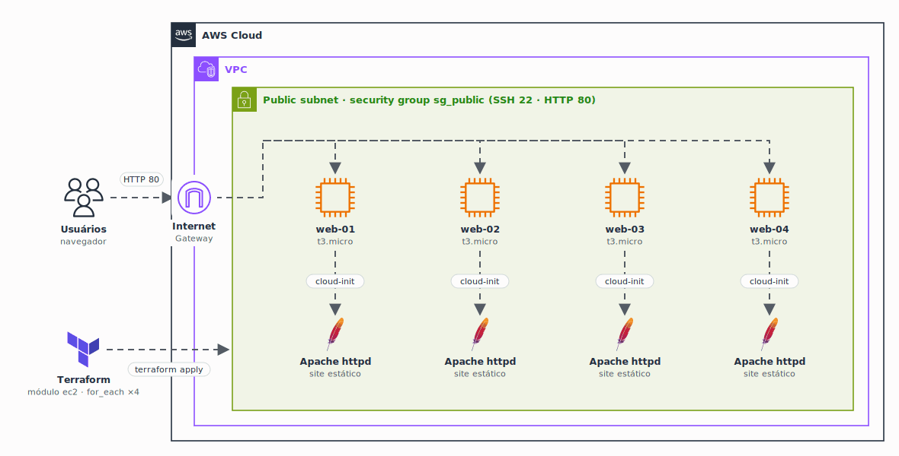

<h1 align="center">
  Módulos Terraform na AWS
</h1>

<p align="center">
  
</p>

<p align="center">
  <a href="https://skillicons.dev">
    
  </a>
</p>

## Qual a finalidade do projeto?

Estudo de **módulos reutilizáveis em Terraform** para a **AWS**. A ideia é escrever o recurso uma única vez, dentro de um módulo, e criar quantas instâncias forem necessárias a partir de um orquestrador, mudando só os valores de cada uma.

O módulo de **EC2** já cria a instância, o security group e as tags padronizadas, e sobe um servidor **Apache** automaticamente via **cloud-init**. O orquestrador usa `for_each` para criar **quatro servidores web** com o mesmo módulo.

> Estudo em andamento: o módulo de **load balancer** ainda está sendo escrito.

## O que foi construído

### Módulos

| Módulo | Caminho | Status |
|---|---|---|
| EC2 | `terraform/aws/compute/ec2` | Instância, security group, tags e cloud-init |
| Load Balancer | `terraform/aws/compute/load-balancer` | Em construção |

### Módulo EC2

| Recurso | Descrição |
|---|---|
| `aws_instance.ec2` | Instância EC2 com AMI, tipo, subnet e IP público configuráveis |
| `aws_security_group.sg_public` | Libera SSH (22) e HTTP (80) para a internet e todo o tráfego interno da VPC |
| Tags | `Name`, `Environment`, `Project`, `Tagteam`, `CostCenter` e `ManageBy = terraform` em todos os recursos |
| Cloud-init | Atualiza o sistema, instala o Apache e publica um site estático |

### Saídas do módulo EC2

| Output | Descrição |
|---|---|
| `vm_id` | ID da instância |
| `vm_arn` | ARN da instância |
| `vm_public_ip` | IP público |
| `vm_private_ip` | IP privado |
| `vm_public_dns` | DNS público |

## Tecnologias utilizadas

- **Terraform:** infraestrutura como código, com módulos e `for_each`;
- **AWS EC2:** servidores virtuais;
- **AWS Security Groups:** regras de rede das instâncias;
- **Cloud-init (Bash):** configuração automática da instância no primeiro boot;
- **Apache (httpd):** servidor web do site estático.

## Estrutura do repositório

```text
studies-terraform-modules/
├── docs/arch.gif                # Diagrama da arquitetura
├── orchertrador.tf              # Orquestrador: cria web-01 a web-04 com o módulo EC2
├── variables.tf                 # Valores padrão (ambiente, projeto, tags, AMI, tipo)
└── terraform/aws/compute/
    ├── ec2/                     # Módulo EC2
    │   ├── ec2.tf               # Instância e cloud-init
    │   ├── sgt.tf               # Security group
    │   ├── locals.tf            # Tags padronizadas
    │   ├── variables.tf         # Entradas do módulo
    │   ├── output.tf            # Saídas do módulo
    │   ├── clud_init.sh         # Script de inicialização (Apache + site)
    │   └── README.md            # Documentação gerada com terraform-docs
    └── load-balancer/           # Módulo de load balancer (em construção)
```

## Fluxo de funcionamento

1. O `variables.tf` da raiz define os valores padrão: ambiente, projeto, time, centro de custo, AMI e tipo de instância.
2. O `orchertrador.tf` monta um mapa com os quatro servidores (`web-01` a `web-04`), cada um com nome, tipo e ambiente próprios.
3. O `for_each` chama o módulo `ec2` uma vez para cada servidor do mapa.
4. O módulo cria a instância, aplica as tags padronizadas e cria o security group.
5. No primeiro boot, o cloud-init instala o Apache e publica o site estático.
6. Os outputs devolvem ID, ARN, IPs e DNS de cada instância.

## Como usar

```bash
terraform init
terraform plan
terraform apply
```

Os valores podem ser sobrescritos em um arquivo `terraform.tfvars`:

```hcl
env           = "dev"
project       = "meu-projeto"
ami_id        = "ami-xxxxxxxxxxxxxxxxx"
instance_type = "t3.micro"
subnet_id     = "subnet-xxxxxxxx"
```

## Como validar a entrega

Em uma validação end-to-end, o `terraform apply` deve criar as quatro instâncias e cada uma deve responder o site estático pelo IP público.

Pontos principais de validação:

- `terraform init` e `terraform validate` sem erros;
- `terraform plan` listando 4 instâncias `aws_instance.ec2` e o security group;
- instâncias `web-01` a `web-04` com as tags `Environment`, `Project`, `Tagteam`, `CostCenter` e `ManageBy`;
- Apache respondendo na porta 80 de cada instância (`curl http://<vm_public_ip>`);
- outputs `vm_id`, `vm_public_ip` e `vm_public_dns` preenchidos;
- `terraform destroy` removendo tudo ao final do estudo.

## Autor

**William Alves Coelho** · [@willtechdev](https://github.com/willtechdev)
